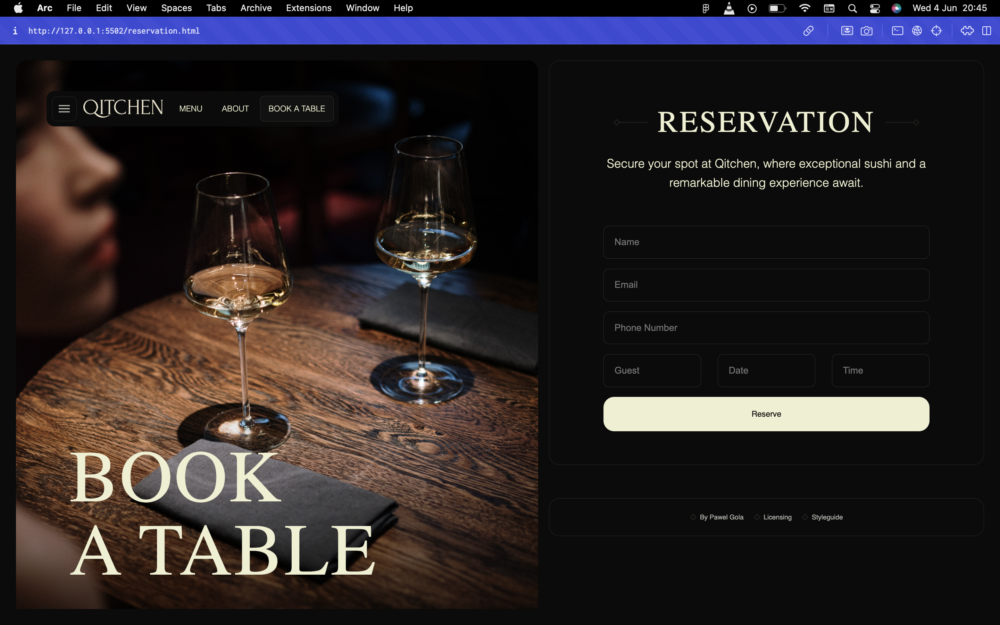

# 🍷 Qitchen – Luxury Dining Restaurant Website

**Qitchen** is a visually stunning, responsive multi-page website built for a fictional luxury restaurant brand. The project combines refined design sensibilities with front-end best practices to create a seamless digital experience that mirrors the sophistication of fine dining.

> Designed with a premium dining experience in mind, Qitchen demonstrates an emphasis on high-end aesthetics, mobile-first responsiveness, and performance-conscious coding.

🔗 **Live Demo**: [qitchen-iota.vercel.app](https://qitchen-iota.vercel.app)

---

## 📸 Visual Showcase

_Elegant Hero Section with Full-Screen Imagery_

_Dynamic and Stylish Menu Showcase_

_Interactive Booking Interface_

_Story-driven About Page with Chef Highlights_

---

## 🧭 Project Overview

Qitchen is a fine-dining restaurant brand site designed to embody elegance and usability. The interface was built to convey exclusivity and quality service through:

- Crisp typography,
- Carefully curated imagery,
- Consistent layout structure,
- Smooth scrolling and interaction cues.

The design mimics luxury restaurant websites seen in global hospitality brands, making it a strong candidate for portfolios showcasing hospitality, lifestyle, or premium web design.

---

## 🔧 Tech Stack

| Technology             | Purpose                                  |
| ---------------------- | ---------------------------------------- |
| **HTML5**              | Semantic structure and accessibility     |
| **SCSS (Sass)**        | Modular, maintainable styling            |
| **CSS Grid / Flexbox** | Responsive layout and alignment          |
| **Vanilla JavaScript** | Form validation and interactivity        |
| **Responsive Design**  | Mobile-first approach across all devices |

---

## 🎨 UI/UX Design Notes

- **Hero Imagery**: Used immersive, high-resolution food photography to emotionally engage visitors.
- **Consistent Color Palette**: Earthy tones and whites to convey warmth, trust, and elegance.
- **Typography**: Serif headings for brand sophistication, paired with modern sans-serif body text for readability.
- **Microinteractions**: Hover states, button feedback, and animated form elements enhance user experience without distraction.

---

## 🧠 What I Learned

- Applying visual hierarchy principles for luxury branding.
- Writing scalable and DRY Sass architecture for large projects.
- Creating accessible forms and touch-friendly components.
- Optimizing image assets for faster load times without sacrificing visual quality.
- Structuring multi-page navigation across a consistent layout.

---

## 🔍 Performance Considerations

- Lazy loading images and assets to improve page speed.
- Reduced DOM complexity for better rendering performance.
- Code splitting using modular SCSS for style maintainability.

---

## 👥 Ideal Use Cases

This project can serve as a template or inspiration for:

- Boutique restaurant brands
- Hospitality businesses
- Food & lifestyle blogs
- Catering services
- Event planning websites

---

## 👤 Author

**Prosper Alex**  
Front-End Developer with a passion for visual storytelling and intuitive user interfaces.

- 🌐 [Portfolio Website](https://personal-profolio-webpage-design.vercel.app)
- 💼 [LinkedIn](https://www.linkedin.com/in/prosper-alex)
- 🐦 [Twitter](https://twitter.com/prosper_alex)

---

## 📜 License

This project is open-source under the [MIT License](LICENSE).

---

## 📬 Contact

For collaboration, feedback, or project inquiries, reach me at:  
📧 [prosperalex0110@gmail.com](mailto:prosperalex0110@gmail.com)
